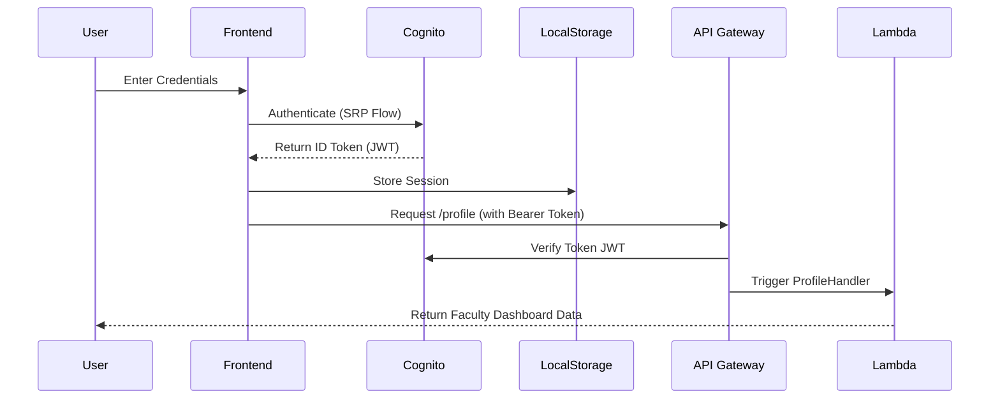

# PRAJNA Technical Architecture & Workflow

## 1. High-Level Architecture

PRAJNA is a **Serverless Full-Stack Application** built on AWS. It uses a Micro-Stack approach to separate concerns and ensure high availability.

### 🛡️ Layer 1: Frontend & Delivery
- **React 18 + Vite**: High-performance Single Page Application (SPA).
- **AWS Amplify (Auth)**: Handles secure login, MFA, and session persistence.
- **Amazon CloudFront**: Global CDN delivering static assets with HTTPS encryption.
- **Amazon S3 (Hosting)**: Secure bucket hosting the compiled React build.

### 🧠 Layer 2: API & Logic (The API Stack)
- **Amazon API Gateway**: The "Front Door" of the backend. It handles routing, throttling, and CORS.
- **AWS Cognito Authorizer**: Validates JWT tokens on every request.
- **AWS Lambda (Node.js 20)**: Lightweight, ephemeral functions that execute business logic:
    - **Research Handler**: DOI metadata fetching and DB storage.
    - **Attendance Handler**: Managing teaching logs.
    - **Document Vault Handler**: S3 Presigned URL generator.

### 🗄️ Layer 3: Persistence & Storage (The Foundation Stack)
- **Amazon DynamoDB (Single Table Design)**:
    - **PK/SK Pattern**: Optimised for fast lookups.
    - **GSI1**: secondary indexes for role-based queries.
- **Amazon S3 (Doc Vault)**: Versioned, AES-256 encrypted storage for faculty evidence.

### 🤖 Layer 4: Intelligence (The AI Stack)
- **Amazon Bedrock (Nova Micro)**: The platform's "Brain".
- **Context-Aware Inference**: Lambdas inject faculty profile data (from DynamoDB) into AI prompts to provide personalised career advice.

---

## 2. Critical Workflows

### 🔑 Workflow A: Secure Authentication

### 📄 Workflow B: Evidence Upload (Document Vault)
This workflow ensures that large files are uploaded securely without overloading the Lambda functions.
1.  **Request**: Faculty clicks "Upload" in the React UI.
2.  **Auth**: Frontend calls `/documents/upload-url` with the filename/type.
3.  **Presign**: Lambda generates a temporary **S3 Presigned URL**.
4.  **Database**: Lambda saves a **'PENDING'** record in DynamoDB.
5.  **Direct Upload**: Frontend uploads the file **directly** to S3 using the temporary URL.
6.  **Success**: UI refreshes, and the file appears in the Vault list.

### 🧬 Workflow C: AI Companion Chat
1.  **Input**: User types "How can I improve my H-Index?" in the chat.
2.  **Context Fetch**: Lambda retrieves the user's current publications from DynamoDB.
3.  **Prompt Engineering**: Lambda builds a prompt: *"You are an expert advisor. This faculty has 5 papers in Scopus. Advise them on..."*
4.  **Bedrock Inference**: Bedrock processes the prompt and returns a stream of text.
5.  **History Persistence**: Lambda saves both the user message and AI response to the Chat History table.

---

## 🔒 Security Best Practices
- **Zero-Trust API**: No endpoint is public (except DOI lookup). Everything requires a Cognito ID Token.
- **CORS Hardening**: Explicit `Access-Control-Allow-Origin` headers prevent unauthorized domains from hitting the API.
- **Data Isolation**: Multi-tenancy is handled at the DynamoDB level using `FACULTY#userId` partition keys.

---

## 🚀 Future Roadmap
- **M13 Approvals**: Using AWS Step Functions for multi-stage HoD → Director approval workflows.
- **M09 Student Feedback**: Using Amazon Comprehend for sentiment analysis on student comments.
- **Real-Time Notifications**: Integrating Amazon SNS for instant mobile alerts on document verification.
